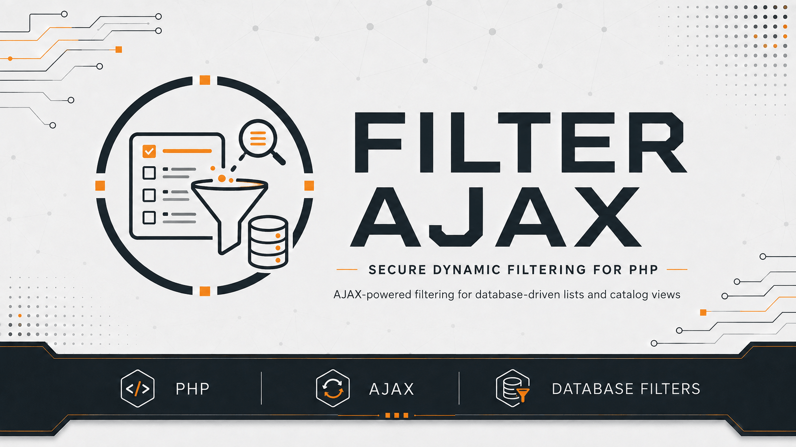
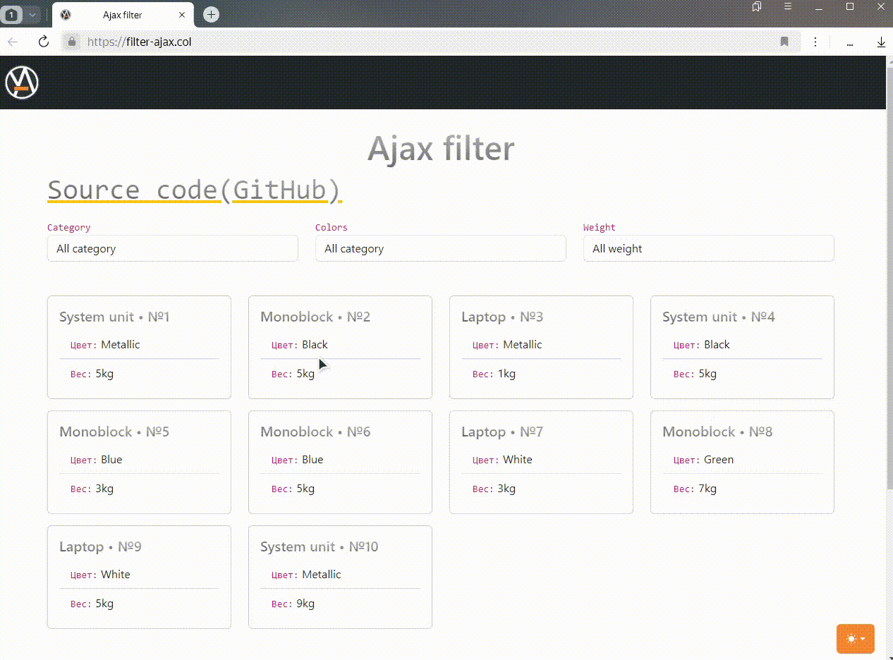

# AJAX Filter

  

## Choose language

| Русский | English | Español | 中文 | Français | Deutsch |
|---|---|---|---|---|---|
| [Русский](../../README.md) | **Selected** | [Español](README_es.md) | [中文](README_zh.md) | [Français](README_fr.md) | [Deutsch](README_de.md) |

## Description

`AJAX Filter` is a small PHP demo project that filters products by category, color, and weight without reloading the page. The client uses native JavaScript and `fetch()`, while the server uses PHP and PDO.

The project intentionally uses neither Composer nor JavaScript libraries and keeps a simple structure suitable for learning basic AJAX filtering.

## Stack

- PHP 8.5
- MySQL / MariaDB through PDO
- Native JavaScript
- Native CSS
- Nginx + PHP-FPM for the provided server example

## Quick start

1. Create a database and import [`docs/mysql-dump/ajax-filter.sql`](../mysql-dump/ajax-filter.sql).
2. Copy [`config/database.php.example`](../../config/database.php.example) to `config/database.php`.
3. Replace the placeholders in `config/database.php` with local database values. This file is ignored by Git.
4. Alternatively, provide `DB_HOST`, `DB_PORT`, `DB_NAME`, `DB_USER`, `DB_PASSWORD`, and `DB_CHARSET`; environment values override file values.
5. Adapt both the web server document root and `fastcgi_pass` to your local environment. An Nginx example is available in [`docs/examples/nginx-configuration.conf`](../examples/nginx-configuration.conf).
6. Open the application through the configured local host.

## How filtering works

When a filter changes, the browser sends a request to `/ajax-filter`. The server accepts only the supported `category`, `color`, and `weight` fields, stores active filters in the session, and executes a parameterized PDO query.

  
Filtering demo

## Theme switching

The interface supports Light, Dark, and System themes with project-owned CSS and native JavaScript; System follows the OS preference.

  
Theme switching demo

## Checks

GitHub Actions validates:

- PHP syntax;
- JavaScript syntax;
- first-party regression tests for filter normalization and session semantics, SQL allowlisting/parameterization and its deterministic query contract, database configuration precedence/validation, HTML escaping, and native autoloading.

## License

The project is distributed under the [MIT](../../LICENSE.md) license.
