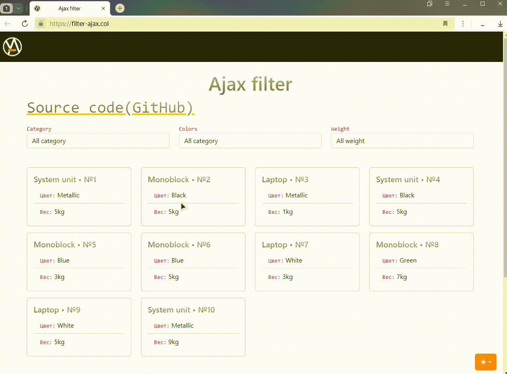

# Projet: Exemple d'Implémentation de Filtres avec Requête Asynchrone

  
Comment fonctionne la filtration

## Choisissez la Langue:

| Русский | English | Español | 中文 | Français | Deutsch |
|---------|------------|------------|-----------|-------------|----------|
| [Русский](../../README.md) | [English](README_en.md) | [Español](README_es.md) | [中文](README_zh.md) | **Sélectionné** | [Deutsch](README_de.md) |

## Stack Technique Utilisé:
- PHP 8
- MySQL (PDO)
- Bootstrap 5.3

## Description:
Le projet implémente la filtration des produits par catégorie, couleur et poids en utilisant des requêtes asynchrones sans bibliothèques supplémentaires en JavaScript natif. Le framework CSS Bootstrap 5.3 est utilisé pour le style, avec un commutateur entre thèmes clair et sombre implémenté dans le modèle. 

  
Comment fonctionne le changement de thème

Dans le répertoire `docs/examples/`, vous trouverez deux fichiers :
1. `nginx-configuration.conf` - un exemple de configuration pour Nginx.
2. `db-config.php.example` - un exemple de fichier de configuration pour la connexion à la base de données. Vous devez changer son nom en `db-config.php`, le copier dans `app/models/database.php` et fournir les données pertinentes pour vous connecter à la base de données.

Le projet n'utilise pas Composer et est écrit de la manière la plus simple possible sans dépendances inutiles.

## Exécution du Projet:
1. Ajoutez la configuration à votre serveur. Dans le répertoire `docs/examples/`, il y a un exemple de configuration pour Nginx. Suivez cet exemple pour configurer votre serveur.
2. Créez une base de données et importez le contenu du fichier `ajax-filter.sql` situé dans `docs/mysql-dump/`.
