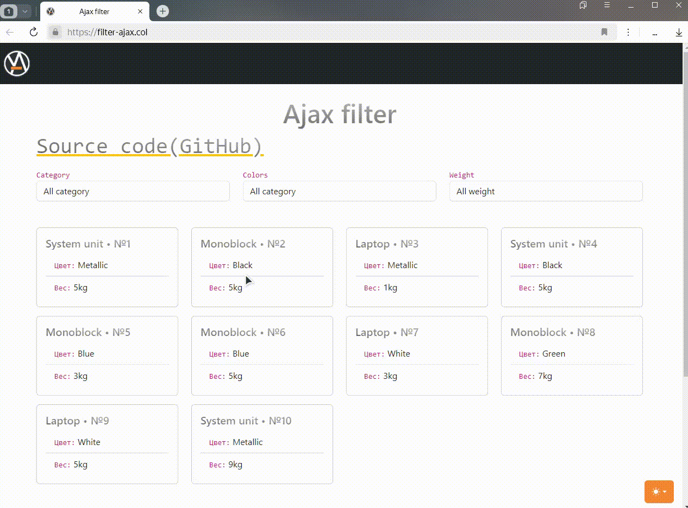

# 项目: 使用异步请求的过滤器示例实现

  
过滤器的工作原理

## 选择语言:

| Русский | English | Español | 中文 | Français | Deutsch |
|---------|------------|------------|-----------|-------------|----------|
| [Русский](../../README.md) | [English](README_en.md) | [Español](README_es.md) | **已选** | [Français](README_fr.md) | [Deutsch](README_de.md) |

## 使用的技术栈:
- PHP 8
- MySQL (PDO)
- Bootstrap 5.3

## 描述:
该项目使用原生JavaScript实现，通过类别、颜色和重量进行产品过滤的功能，使用异步请求而无需额外的库。CSS框架Bootstrap 5.3用于样式化，在模板中实现了浅色和深色主题之间的切换。

  
主题切换是如何工作的

在`docs/examples/`目录中，您会找到两个文件：
1. `nginx-configuration.conf` - 适用于Nginx的配置示例。
2. `db-config.php.example` - 用于连接数据库的配置文件示例。您需要将其名称更改为 `db-config.php`，将其复制到 `app/models/database.php` 并提供连接到数据库所需的相关数据。

该项目不使用Composer，并尽可能简单地编写，避免不必要的依赖。

## 运行项目:
1. 将配置添加到您的服务器。在`docs/examples/`目录中，有一个适用于Nginx的配置示例。按照此示例配置您的服务器。
2. 创建数据库并导入位于`docs/mysql-dump/`中的`ajax-filter.sql`文件的内容。
